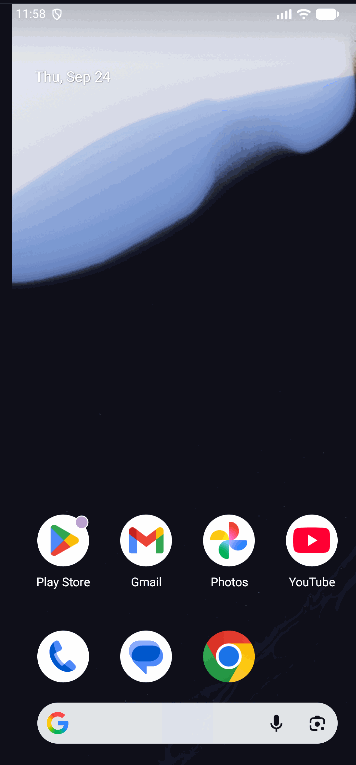

# Android Project 3 - *Flixster+*

Submitted by: **YOUR NAME**

**Flixster+** is an app that allows users to browse movies currently playing in theaters, using The Movie Database (TMDB) API.

Time spent: **X** hours spent in total

## Required Features

The following **required** functionality is completed:

- [x] **Make a request to The Movie Database API's `now_playing` endpoint to get a list of current movies**
- [x] **Parse through JSON data and implement a RecyclerView to display all movies**
- [x] **Use Glide to load and display movie poster images**

## Optional Features

The following **optional** features are implemented:

- [x] Improve and customize the user interface through styling and coloring
  - Dark Material 3 theme with a red accent, rounded cards, consistent spacing, and bold title / muted body typography
- [x] Implement orientation responsivity
  - App should neatly arrange data in both landscape and portrait mode
  - Portrait: single-column list. Landscape: 2-column grid with a separate `layout-land/item_movie.xml` (edge-to-edge poster, fixed-height cards)
- [x] Implement Glide to display placeholder graphics during loading
  - Note: this feature is difficult to capture in a GIF without throttling internet access. Instead, include an additional screenshot of your app with placeholder graphics displayed.
  - Uses `.placeholder()` while loading and `.error()` / `.fallback()` for failed loads or movies with no `poster_path`

The following **additional** features are implemented:

- [x] Loading spinner while movies are fetched, and a Toast on network/parse failure
- [x] TMDB API key kept out of source control (read from `local.properties` into `BuildConfig`)
- [x] Handles edge-to-edge display insets (status bar, nav bar, landscape cutouts)

## Video Walkthrough

Here's a walkthrough of implemented user stories:



<!-- Replace this with whatever GIF tool you used! -->
GIF created with ...

<!-- Placeholder screenshot: e.g. set the emulator's network speed to a slow profile
     (Extended controls > Cellular) so the placeholder graphics are visible. -->

## Notes

- **Partial poster paths:** TMDB returns paths like `/abc.jpg`, so the app builds the full URL by prepending `https://image.tmdb.org/t/p/w500/`. It also strips the leading slash to avoid a double `//`.
- **Null posters:** some movies have no `poster_path`. `Movie.posterUrl` returns `null` in that case, and Glide's `.fallback()` shows the error graphic instead of crashing.
- **Threading:** the OkHttp call runs on `Dispatchers.IO` inside `lifecycleScope`, so it stays off the main thread and is cancelled if the Activity is destroyed. Only `IOException` and Gson's `JsonParseException` are caught; a broader `RuntimeException` catch would also swallow coroutine cancellation.
- **Landscape text clipping:** a fill-height TextView with `ellipsize="end"` clips mid-line instead of adding "…". Setting an explicit `maxLines` fixed it.
- **Edge-to-edge:** targeting SDK 35+ forces edge-to-edge drawing, so window insets have to be applied manually to keep the toolbar and last list item out from under the system bars.

## Setup

Add your TMDB key to `local.properties` (this file is git-ignored):

```
TMDB_API_KEY=your_key_here
```

Then open the `Flixster` folder (the one containing `settings.gradle`) in Android Studio, let Gradle sync, and run the `app` configuration.

## Project Structure

Follows the CodePath lab 3 layout (Activity → Fragment → RecyclerView adapter):

- `MainActivity.kt`: hosts the toolbar and places `MoviesFragment` in `R.id.content`
- `MoviesFragment.kt`: fetches now-playing movies and sets up the RecyclerView (`fragment_movies_list.xml`)
- `MovieRecyclerViewAdapter.kt`: binds each `Movie` to `fragment_movie.xml` (with a separate `layout-land` version)
- `OnListFragmentInteractionListener.kt`: item-click callback, implemented by `MoviesFragment`
- `Movie.kt` / `NowPlayingResponse.kt`: Gson models
- `network/ApiClient.kt`: OkHttp request to TMDB, run on `Dispatchers.IO`

## License

    Copyright [yyyy] [name of copyright owner]

    Licensed under the Apache License, Version 2.0 (the "License");
    you may not use this file except in compliance with the License.
    You may obtain a copy of the License at

        http://www.apache.org/licenses/LICENSE-2.0

    Unless required by applicable law or agreed to in writing, software
    distributed under the License is distributed on an "AS IS" BASIS,
    WITHOUT WARRANTIES OR CONDITIONS OF ANY KIND, either express or implied.
    See the License for the specific language governing permissions and
    limitations under the License.
